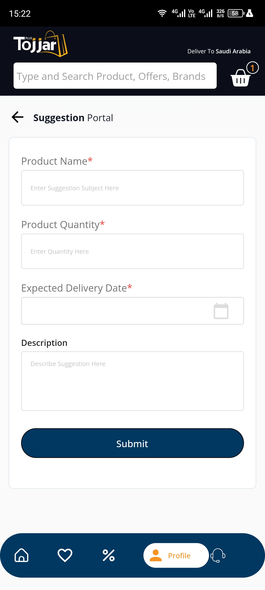
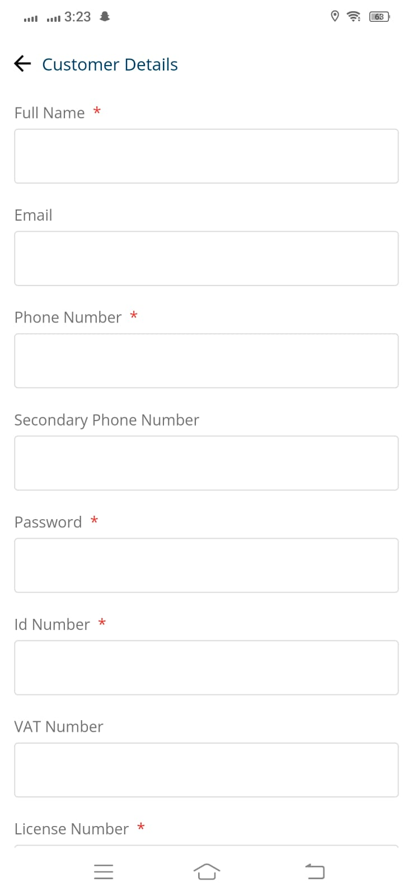

# Tojjar
 

INTRODUCTION
The Tojjar Marketplace Application is a comprehensive platform designed to facilitate online transactions between customers, sales agents, delivery personnel, and administrators. It serves as a centralized hub where customers can explore and purchase a wide range of products and services.

KEY FEATURES:

CUSTOMER APPLICATION:
1. User-friendly interface for customers to browse, search, and purchase products or services.
2. Product listings with detailed descriptions, images, and pricing information.
3. Shopping cart functionality for customers to add items, manage quantities, and proceed to checkout.
4. Secure payment processing integration to facilitate smooth transactions.
5. Order tracking system to provide customers with real-time updates on their purchases.
6. Customer support features for inquiries, feedback, and assistance.

SALES AGENT APPLICATION:
1. Dedicated application for sales agents to manage their product listings and inventory.
2. Product management tools to add, edit, or remove listings, along with relevant information and pricing.
3. Order management features to handle customer orders, update order status, and communicate with customers.
4. Sales analytics and reporting to track performance, sales trends, and customer preferences.
5. Communication channels to connect with customers and address their queries.

DELIVERY PERSONAL APPLICATION:
1. Application for delivery personnel to receive and manage delivery assignments.
2. Real-time tracking of orders for efficient and timely delivery.
3. Integration with mapping services to optimize routes and navigation.
4. Proof of delivery functionality to confirm successful order completion.
5. Communication features to coordinate with customers and handle delivery-related queries.

ADMIN PORTAL:
1. Centralized administration dashboard to manage the entire marketplace ecosystem.
2. User management to handle customer, sales agent, and delivery personnel accounts.
3. Content management system to update and maintain product listings, categories, and promotions.
4. Reporting and analytics to monitor marketplace performance, sales metrics, and user activity.
5. Customer support and dispute resolution tools to handle complaints or issues.

TECHNOLOGIES & TOOLS USED
1. Flutter
2. Laravel(PHP) Server Side(BACKEND)
3. SQL Database
4. Cubit State Management
5. Payment Gateway
6. REST APIs
7. Google Maps
8. Adbobe Xd(Used for UI Prototype)

CUSTOMER SIDE SCREENSHOTS

          

DELIVERY PERSONAL SCREENSHOTS

                   

SALES AGENT APPLICATION SCREENSHOTS

               

                                                              THANKS

